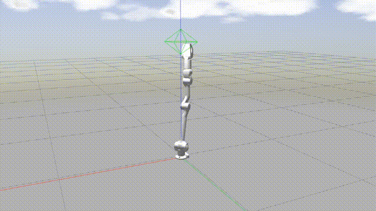
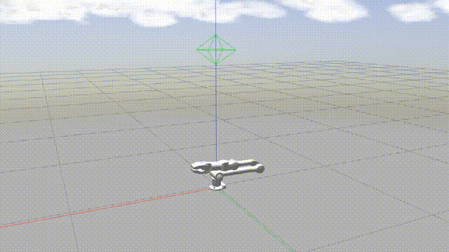
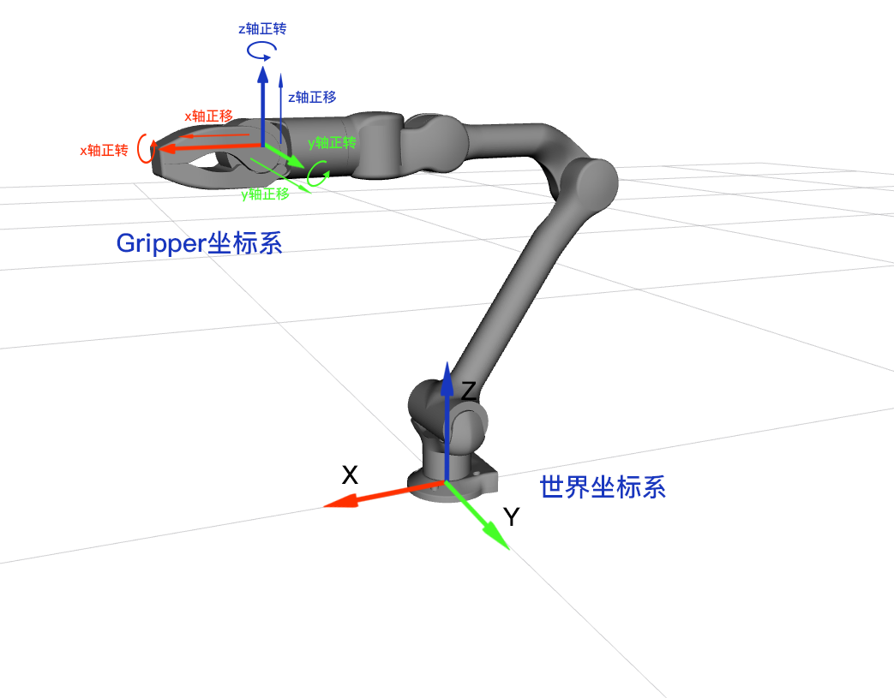
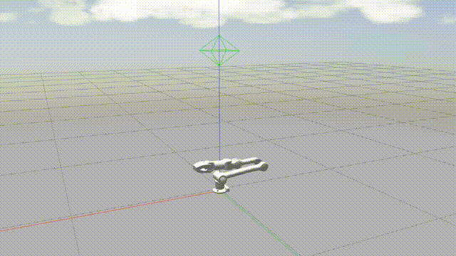
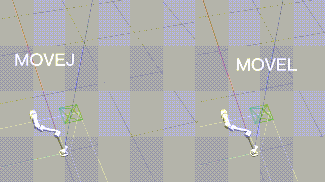

# Control Mode

z1 robotic arm provides a variety of high level control modes, such as Joint Space Control, Cartesian Space Control,MOVEJ, MOVEL, MOVEC, etc. Understanding these control modes enable users to better know how to send commands to`z1_ws`to control the movement of the robotic arm.

## Joint Space Control

 

Joint Space Control Demonstration

 

Joint Space Control: The control to the variables of each joint of the robot. The user directly gives the angle command of the joint to control the robotic arm movement.

As shown above, this example is the result of the robotic arm turning J2, J3, and gripper in sequence. 

## Cartesian Space Control

 

Cartesian Space Control Demonstration

 

Cartesian Space Control: It is control for the end pose variables of the robot. 
The user directly sends the expected end pose of the robotic arm to the controller`z1_ctrl`，after calculation by kinematics and dynamics,`z1_ctrl` will obtain the corresponding angle and angular speed of each joint then send these commands to the robotic arm to control its movement.

 

Cartesian Space Control

 

By default, the Gripper Coordinate System is used as the control reference system for the end of the robotic arm.But in `z1_ctrl`, the function should be called Cartesian Space Control Speed in a strict sense, that is, the user giving the end pose increment of the robotic arm each time.

## MOVEJ

 

MOVEJ Demonstration

 

In the Cartesian Space Control mode, the user gives the end pose increment of the robotic arm, while in MOVEJ, the user can directly give one or more expected end poses to control the robotic arm movement. In this mode, the robot arm will move to the target point in the fastest way, its movement state is not completely controllable, howerer, the movement path remains unique.

## MOVEL

 

MOVEL Demonstration

 

In MOVEL mode, the robotic arm moves in a straight line from one end pose to the next.

## MOVEC

In MOVEC mode, the robot arm will reach the target point through the intermediate point in a circular motion according to the given initial point.
