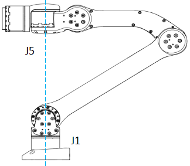

# Singular Point

## Concept

When the robotic arm is in a singular position, the degrees of freedom will degenerate and it will make the angular velocity of some joints to be infinite, and the robotic will be at the risk of losing control. 

## Singular Position

Singular shoulder joint: The coaxial area of the fifth joint axis and the first joint axis is the singular position of the robotic arm, as shown in the figure below.

In Cartesian space, this area should be avoided as much as possible. Robotic arm adopts the method of QP to solve inverse kinematics problem.

It is recommended to run the robotic arm to the forward point after power-on to avoid this area.

 

Singular Position of the Robotic Arm

 
