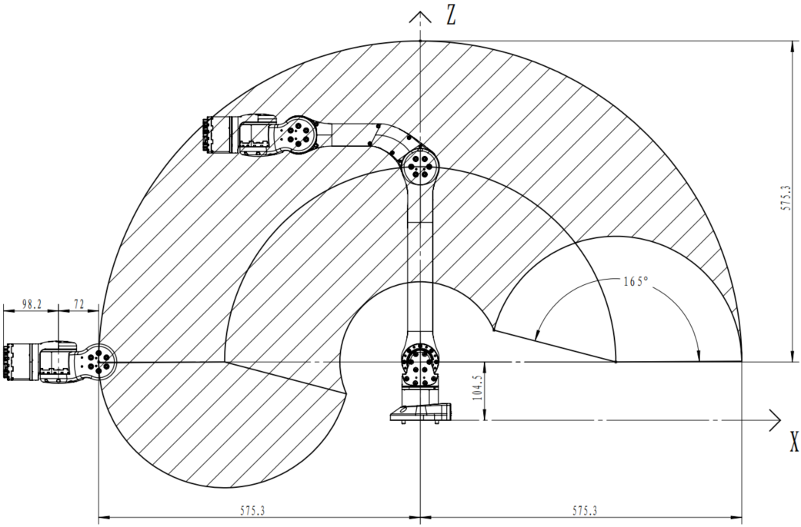
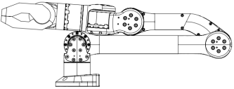

# Z1 Robotic Arm Installation

## The Movement Range of Z1 Robotic Arm

When installing the robotic arm, consider the movement range of the robotic arm to avoid unnecessary losses. The movement range of the robotic arm please see below:

 

The movement range of Z1 robotic arm

 

The movement range of each joint please see below.

<table border="1">
    <tr><td>Joint</td><td>Minimum</td><td>Maximum</td></tr>
    <tr><td>J1</td><td>-150°</td><td>150°</td></tr>
    <tr><td>J2</td><td>0°</td><td>180°</td></tr>
    <tr><td>J3</td><td>-165°</td><td>0°</td></tr>
    <tr><td>J4</td><td>-80°</td><td>80°</td></tr>
    <tr><td>J5</td><td>-85°</td><td>85°</td></tr>
    <tr><td>J6</td><td>-160°</td><td>160°</td></tr>
</table>

The actual calculation uses radian system, and other information such as coordinate axes and inertia matrix are described in the document ~/z1_ws/ SRC /z1_ros/z1_description/xacro.

## Installation of Robotic Arm

When fixing the robotic arm, the user can design and install the platform according to the hole size of the robotic arm base and the real environment. The fixed platform of the robotic arm needs to bear not only its weight, but also the instantaneous dynamic force during the maximum acceleration movement. Four M6 bolts are used for the robotic arm, and the robotic arm is installed with a hex wrench. The base installation please see below:

 

Installation Diagram of Robotic Arm Base

 

Certainly, we provide fixing plates and G clips for directly being fixed to the desktop.

 

Installation of Robotic Arm

 

## Cable Connection

There are two main types of robotic arm cables: power supply cables and telecommunication cables. The connector of the power supply cable of the robotic arm has a mistake-proof function, and the power supply cable can be inserted into the power supply port of the robotic arm as shown in the figure below. Meanwhile, insert one end of the telecommunication cable (the network cable) in the network port of the robot arm as shown in the figure below and lock it tightly, and the other end of the telecommunication cable is connected to the computer.

 

Connection Diagram of the Robotic Arm

 

## Power-on

**Make sure that the movement program is turned off** before power on the robotic arm, otherwise there may be danger. And let the robotic arm stay in zero position. The zero position of the robotic arm is as shown in the figure below. The lines on both sides of the joint gaps of J1 and J6 correspond exactly, and the other joints can be placed in order.

 

Zero Position of Z1 Robotic Arm

 

When the device is powered on successfully, the green light is steady on, and the blue light will flash once the self-check passes.

It should be noted that each joint of the robotic arm should be turned to the zero position before use every time, so that the theoretical zero position in the control algorithm coincides with the actual mechanical zero position. In addition, the black and white power cord of the motor at the end of the robotic arm has DC24V power supply. If it is not needed, be sure to wrap the black and white power cord with insulating tape to prevent danger such as short circuit.

## 关节说明

 

Joint Serial Number and Positive Direction of Joint Rotation Definition

 

Before controlling the robotic arm, it is necessary to understand the joint definition and the positive direction of rotation. Unitree Z1 is a six degrees of freedom robotic arm, and the serial numbers of its joints start from J1 and increase to J6 one by one. In the above figure, **key +** represents the positive direction of the joint rotation, and **key -** represents the negative  direction. Knowing the positive direction of rotation is helpful for later use of joint space control.

基于指数积进行机械臂各种运算所需的参数如下：

|关节|ω|υ|
|:-:|:-:|:-:|
|J1|[0, 0, 1]|[0, 0, 0.065]|
|J2|[0, 1, 0]|[0, 0, 0.1115]|
|J3|[0, 1, 0]|[-0.35, 0. 0.1115]|
|J4|[0, 1, 0]|[-0.132, 0, 0.1685]|
|J5|[0, 0, 1]|[-0.06, 0, 0.1685]|
|J6|[1, 0, 0]|[-0.0128, 0, 0.1685]|

其中手爪装载平面（即J6末端平面）的绝对初始位置为[0,049, 0, 0.1605]
Unitree_gripper中心相对于装载平面的位置为[0.0382, 0, 0]，即config.xml里的endPosLocal参数
