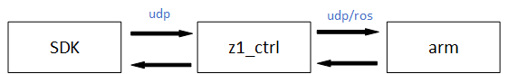

# Z1 Robot Arm

Welcome to use the Unitree Z1 robot arm and thank you for your purchase.

This document contains information about the installation and commissioning of the Z1 robot arm, and how to do secondary development based on the API.

## Abstract

Z1 can realize various upper-level control modes such as joint space control, Cartesian space control, etc. It can also realize the low-level control of the underlying joint motors, based on which users can develop their own control algorithms. To achieve the above control relies on the use of the robotic arm SDK. There are currently two ways to control the robotic arm through the robotic arm SDK.

+ **Code Control**
You can write C++ programs to call the robotic arm development interface to control the robotic arm.
+ **Keyboard control**
The robotic arm can be controlled directly from the keyboard.

The robotic arm SDK also supports physical control and simulation control, where the simulator used for simulation control is Gazebo.

## File Structure

Z1 package contains three files(Attached download address)。

+ [z1_controller](https://github.com/unitreerobotics/z1_controller)

This folder contains the control implementation part of the robot arm.

+ [z1_sdk](https://github.com/unitreerobotics/z1_sdk)

This folder contains the interface to the control program.

+ [unitree_ros](https://github.com/unitreerobotics/unitree_ros)

This folder contains the files related to the ROS simulation model.

 

Relationship Map

 

As shown in the figure, the robot arm's controller `z1_ctrl` issues commands to the robotic arm in gazebo through the ros system during the simulation control. In the physical control, commands are issued to the physical arm via udp, and the arm-related status, such as joint information and end position, is returned to `z1_ctrl` in the same way.The robotic arm sdk `unitree_arm_sdk` sends the user's control commands to `z1_ctrl` via udp, while `z1_ctrl` feeds the status information returned by the robot arm to `unitree_arm_sdk` via udp, and the user gets the relevant information by reading the relevant structures.
Therefore, because of the above-mentioned relationship between the three, the actual user start-up process should be

1. Start `robotic arm`: If it is physically controlled, check whether the mechanical part is powered on successfully and whether the device bule light is flashing. If it is emulation control, check if the `roslaunch z1_gazebo z1.launch` command is started.

2. Start `z1_ctrl`

3. Start `z1_sdk`
