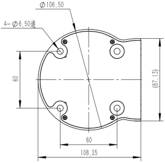
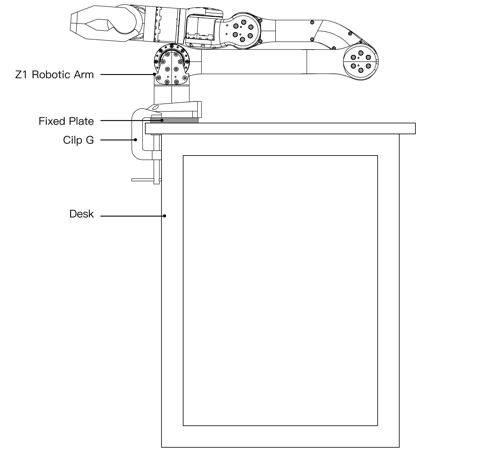
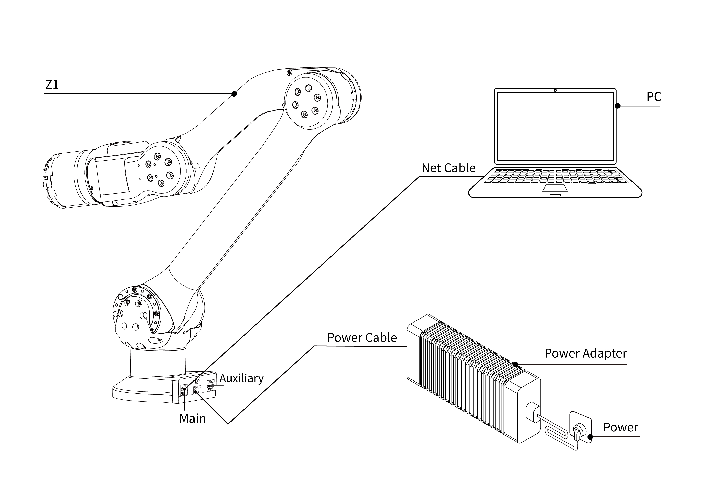

# Z1 Robotics Arm Installation

## Packing List

<center>
<table border="1">
    <tr><td>Type</td><td>Quantity</td><td>Note</td></tr>
    <tr><td>Z1</td><td>1</td><td>/</td></tr>
    <tr><td>Power Adapter</td><td>1</td><td>DC24V</td></tr>
    <tr><td>Fixed Plate</td><td>1</td><td>/</td></tr>
    <tr><td>Clip G</td><td>2</td><td>/</td></tr>
    <tr><td>Net Cable</td><td>1</td><td>2m</td></tr>
    <tr><td>Hexagon socket screws</td><td>4</td><td>M6X16</td></tr>
    <tr><td>Hexagon socket screws</td><td>2</td><td>M2.5X8</td></tr>
    <tr><td>2mm Hexagonal wrench</td><td>1</td><td>/</td></tr>
    <tr><td>5mm Hexagonal wrench</td><td>1</td><td>/</td></tr>
</table>
</center>

## Installation of Robotics Arm

When fixing the robotic arm, the user can design and install the platform according to the hole size of the robotic arm base and the real environment. The fixed platform of the robotic arm needs to bear not only its weight, but also the instantaneous dynamic force during the maximum acceleration movement. Four M6 bolts are used for the robotic arm, and the robotic arm is installed with a hex wrench. The base installation please see below:

<center>

<br>
<div style="color:orange; border-bottom: 0.1px solid #d9d9d9;
display: inline-block;
color: #999;
padding: 1px;">Installation Diagram of Robotic Arm Base</div>
</center>
<br>

Certainly, we provide fixing plates and G clips for directly being fixed to the desktop.

<center>

<br>
<div style="color:orange; border-bottom: 0.1px solid #d9d9d9;
display: inline-block;
color: #999;
padding: 1px;">Installation of Robotic Arm</div>
</center>
<br>

## Cable Connection

There are two main types of robotic arm cables: power supply cables and telecommunication cables. 
The connector of the power supply cable of the robotic arm has a mistake-proof function, 
and the power supply cable can be inserted into the power supply port of the robotic arm as shown in the figure below.

```note
The main network port is used to control the robot, and the auxiliary network port is used to change the default IP address. The two should not be mixed.

The power supply is not hot-swappable.
```

<center>

<br>
<div style="color:orange; border-bottom: 0.1px solid #d9d9d9;
display: inline-block;
color: #999;
padding: 1px;">Connection Diagram of the Robotic Arm</div>
</center>
<br>
