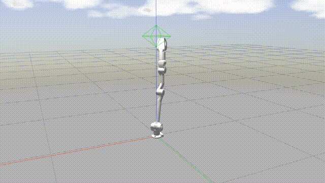

# Keyboard Control

The state machine of robotic arm corresponds to a certain function. 
The state machine specification of Z1 robotic arm is shown as follows: 

|State|KeySwitch|Switchable|
|:-:|:-:|:-:|
|BACKTOSTART|~|1 2|
|PASSIVE|1|~ 2 3 =|
|JOINTCTRL|2|~ 1 3 4 5 6 7 8 9 0 -|
|CARTESIAN|3|~ 1 2 4 5 6 9|
|MoveJ|4|~ 1 2 3 5 6 9|
|MoveL|5|~ 1 2 3 4 6 9|
|MoveC|6|~ 1 2 3 4 5 9|
|TEACH|7|~ 1 2|
|TEACHREPEAT|8|automatically switched to 2|
|SAVESTATE|9|automatically switched to 2|
|TOSTATE|0|automatically switched to 2|
|CALIBRATION|=|automatically switched to 1|

In keyboard control mode, you can enter the state machine by pressing a key. Under the Switchable list, you can find another state machine which can be accessed through a certain state machine.

**To avoid singular problems, it is recommended that running the robotic arm to the forward pose through TOSTAET state machine before use.**

## BACKTOSTART

All motors return to initial positions.

## PASSIVE

All motors get into passive state(default state after power on).

## JOINTCTRL

When controlling the joint space speed, the six joints of robotic arm can be directly given by long pressing the keyboard and thus to control the movement of the robot arm.

It should be noted again that all joint coordinate systems are right-handed, and we should pay attention to the forward and reverse movement trend of each joint before use to ensure safe operation.

<table border="1">
    <tr>
        <td>Joint ID</td>
        <td>0</td><td>1</td><td>2</td><td>3</td><td>4</td><td>5</td>
        <td>Gripper</td>
    </tr>
    <tr>
        <td>Keyboard</td>
        <td>Q/A</td><td>W/S</td><td>D/E</td><td>R/F</td><td>T/G</td><td>Y/H</td>
        <td>up/down</td>
    </tr>
    <tr>
        <td>
Joint Action
(right hand)</td>
        <td>
positive/
negative</td><td>
positive/
negative</td>
        <td>
positive/
negative</td><td>
positive/
negative</td>
        <td>
positive/
negative</td><td>
positive/
negative</td>
        <td>
positive/
negative</td>
    </tr>
</table>

 

Joint Space Control Demonstration

 

## CARTESIAN

In Cartesian space control, the movement speed of expected place and posture for the end of robot arm can be given by directly through the keyboard or handle, and thus to control the movement of the robotic arm.

<table border="1">
    <tr>
        <td>Keyboard</td>
        <td>Q/A</td><td>W/S</td><td>E/D</td><td>R/F</td><td>T/G</td><td>Y/H</td>
    </tr>
    <tr>
        <td>Key Function</td>
        <td>
forward/
backward</td><td>
right/
left</td><td>
up/
down</td>
        <td>roll</td><td>pitch</td><td>yaw</td>
    </tr>
</table>

 

Cartesian Space Control Demonstration

 

## MOVEJ、MOVEL、MOVEC

Input the coordinates of the specific point [roll pitch yaw x y z]

The coordinates of the points can be moved to the target position through joint control, and then saved to "csv" file through the "savestate" state machine or obtained by calling the "getJointState" executable file.

Example:

1. First run the robotic arm to the "forward" pose

    Press 0, input forward, then click Enter

2. MOVEJ

    Press 4, input 0.5 0.1 0.1 0.5 -0.2 0.5

    Please make sure the input is correct, and click Enter twice, then the robotic arm starts to move.

    Note: The purpose of clicking Enter twice: When controlling the keyboard, the user is allowed to continually input the next pose after clicking Enter. Once you finish the input, click Enter twice, it will execute in order.

3. MOVEL

    Press 5, input 0 0 0 0.45 -0.2 0.2, then click Enter twice.

4. MOVEC

    Press 6, input two poses, the intermediate pose, and the final pose. 

    Input 0 0.2 0 0.4 0 0.3 and then click Enter, then input 0 -0.1 0.5 0.5 0.25 0.44 and click Enter twice. The sample program details, please find in the bigDemo example.

## TEACH

First, press"~"to make the robotic arm return to the origin, or control the robotic arm move to a certain initial point, press 2 to enter the joint control state machine, then press 7 to enter the teaching state machine, input the label name and click Enter , then you can manipulate the robotic arm to move in a certain trajectory, the trajectory will be recorded constantly until the user clicks 2 to enter the joint space control.

The trajectory will be saved in a new ".csv" file in directory catalog Z1_controller/config.

## TEACHREPEAT

Press 8 on the keyboard to enter the repeated teaching state machine, input the saved trajectory label name (check the csv file to confirm), the robotic arm will repeat the teaching trajectory movement.

## SAVESTATE

Pressing 9 on the keyboard allows to record the angle of each joint of the robotic arm as a label at a certain moment, this function is called "label recording".

The robotic arm will automatically save the current pose state and input a custom label name according to the prompts. The recorded labels are saved in the file "savedArmStates.csv". After completion, the robotic arm will automatically turn to the joint space control state.

## TOSTATE

Press 0 on the keyboard, input the stored label name, then click Enter, the robotic arm will automatically move to the corresponding pose.

When the movement completed, the robotic arm will automatically turn to the joint space control state.

## CALIBRATION

Press"="on the keyboard to set the current position as the initial position. After completing the setting, the robotic arm will automatically turn to the passive state.

A new robotic arm needs to perform this operation in the first step of running the program.
